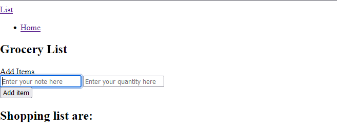

# Grocery List App
This is just a basic html and vue js page where you can add grocery and delete them.

Table of Contents
=================

  * [Dockerfile.vim](#dockerfilevim)
  * 
  * [Installation](#installation)
        * [OR using Pathogen:](#or-using-pathogen)
        * [OR using Vundle:](#or-using-vundle)
  * [Diego Castillo](#license)

###  How it works
This app is created, to add quantity and the type of grocery you were going to get as many as you like. If you need to delete an item,
there is a button for it as well. 

 
