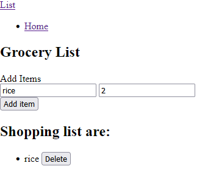

# Grocery List App
This is just a basic html and vue js page where you can add grocery and delete them.

Table of Contents
=================

  * [Main](#dockerfilevim)
  * 
  * [Diego Castillo](#license)

###  How it works
This app was created to add quantity and the type of grocery you were going to get as many as you like. If you need to delete an item,
there is a button for it as well. 

 
